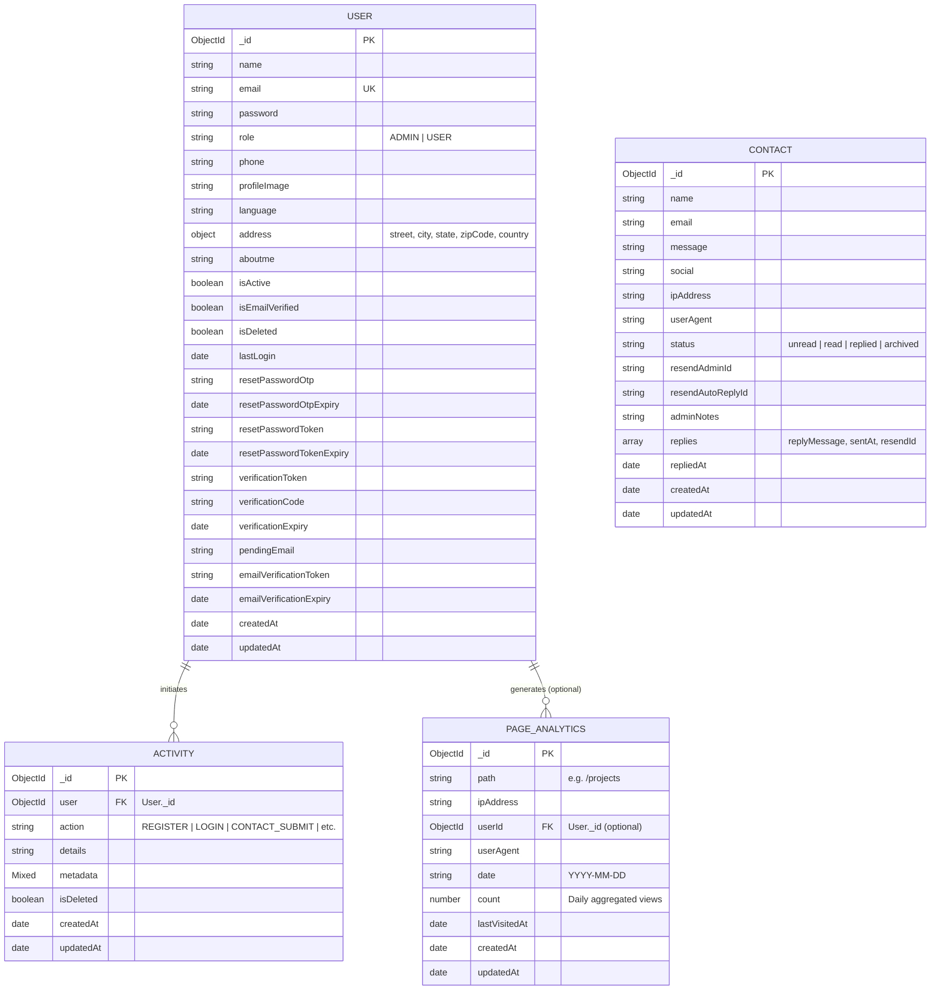

<div align="center">

# 🚀 Appon Islam - Professional Portfolio Backend API

### High-Performance RESTful API & Management System

  <br />

[](https://www.apponislam.com)

  <br />

[](https://www.typescriptlang.org/)
[](https://nodejs.org/)
[](https://expressjs.com/)
[](https://www.mongodb.com/)
[](LICENSE)

---

### 🔗 **Live Website Application**: [https://www.apponislam.com](https://www.apponislam.com)

---

</div>

<br />

A robust, enterprise-grade RESTful API backend engineered for [Appon Islam's Portfolio & Management System](https://www.apponislam.com). Built with Node.js, Express, TypeScript, and MongoDB, featuring secure JWT authentication, multi-factor OTP flows, background activity audit logging, Resend email automation, and privacy-conscious page analytics tracking.

---

## 🌐 Live Website

> 🚀 **Explore the Live Application**: **[https://www.apponislam.com](https://www.apponislam.com)**

---

## 🌟 Key Features

- **🔐 Authentication & Security**:
  - JWT Access Tokens & HTTP-only Refresh Cookies
  - bcrypt password hashing
  - Multi-step OTP email verification & password reset workflows
  - Role-based Access Control (RBAC: `ADMIN` & `USER`)
- **📊 Page Analytics Engine**:
  - Daily aggregated tracking per unique IP and endpoint path
  - Accurate distinct visitor calculations
  - Traffic trends and top-visited page metrics
- **📬 Contact Management & Email Automation**:
  - Resend integration for automated user auto-replies and admin email alerts
  - Admin inbox state management (`unread`, `read`, `replied`, `archived`)
- **📜 Background Activity Audit Logging**:
  - Asynchronous background logging for key user/auth actions
  - Filterable activity timelines with pagination and soft deletion
- **⚡ Performance & Middleware**:
  - Request body validation via Zod schemas
  - Centralized global error handling with custom `ApiError`
  - Gzip HTTP response compression & CORS security headers

---

## 🗄️ Database Architecture & Entity Relationship Diagram

The backend relies on MongoDB with Mongoose ODM schemas optimized using compound indexing, soft deletions, and relational references (`Schema.Types.ObjectId`).



### Database Schema Highlights

| Collection | Key Indexes | Description |
| :--- | :--- | :--- |
| **`users`** | `{ email: 1 }` (Unique), `{ resetPasswordToken: 1 }`, `{ lastLogin: -1 }` | Stores administrative and registered user accounts, credential security, and active verification tokens. |
| **`activities`** | `{ user: 1, isDeleted: 1, createdAt: -1 }` | Asynchronous audit logs capturing user events across auth and system interactions. |
| **`contacts`** | `{ status: 1, createdAt: -1 }`, `{ name: text, email: text, message: text }` | Handles incoming contact form submissions, email delivery metadata, and reply histories. |
| **`pageanalytics`** | `{ date: 1, path: 1, ipAddress: 1 }` (Compound Unique) | Aggregates daily page views per IP per route to minimize DB records while providing exact analytics. |

---

## 🛠️ Tech Stack & Dependencies

- **Runtime**: [Node.js](https://nodejs.org/) (v20+)
- **Language**: [TypeScript](https://www.typescriptlang.org/)
- **Framework**: [Express.js v5](https://expressjs.com/)
- **Database**: [MongoDB](https://www.mongodb.com/) + [Mongoose v9](https://mongoosejs.com/)
- **Email Service**: [Resend API](https://resend.com/)
- **Security & Utilities**: `bcrypt`, `jsonwebtoken`, `zod`, `cookie-parser`, `cors`, `compression`, `morgan`

---

## ⚙️ Environment Configuration

Create a `.env` file in the project root:

```env
NODE_ENV=development
PORT=5000
DATABASE_URL=mongodb+srv://<username>:<password>@cluster.mongodb.net/apponislam-portfolio?retryWrites=true&w=majority

# JWT Secrets
JWT_ACCESS_SECRET=your_jwt_access_secret_key
JWT_ACCESS_EXPIRES_IN=7d
JWT_REFRESH_SECRET=your_jwt_refresh_secret_key
JWT_REFRESH_EXPIRES_IN=30d

# Resend Email Integration
RESEND_API_KEY=re_123456789
SENDER_EMAIL=noreply@apponislam.com
ADMIN_EMAIL=contact@apponislam.com

# Client Origin
CLIENT_URL=https://www.apponislam.com
```

---

## 🚀 Getting Started

### 1. Installation

```bash
git clone https://github.com/apponislam/apponislam-portfolio-server.git
cd apponislam-portfolio-server
npm install
```

### 2. Run Development Server

```bash
npm run dev
```

The server will start on `http://localhost:5000`.

### 3. Build for Production

```bash
npm run build
npm start
```

---

## 📄 API Routes Overview

- **Auth Routes** (`/api/v1/auth`): Login, Registration, OTP Verification, Password Reset, Profile Update, Token Refresh.
- **Contact Routes** (`/api/v1/contact`): Contact Submission (Public), Reply to Messages, Inbox Filtering & Archiving (Admin).
- **Activity Log Routes** (`/api/v1/activity`): Query audit logs, filter by user/type/date, soft delete (Admin).
- **Page Analytics Routes** (`/api/v1/page-analytics`): Page view tracking endpoint (`/track`), Summary stats (`/stats`), Top pages (`/top-pages`), Detailed logs (`/logs`).

---

## 📜 License

This project is licensed under the [MIT License](LICENSE).
